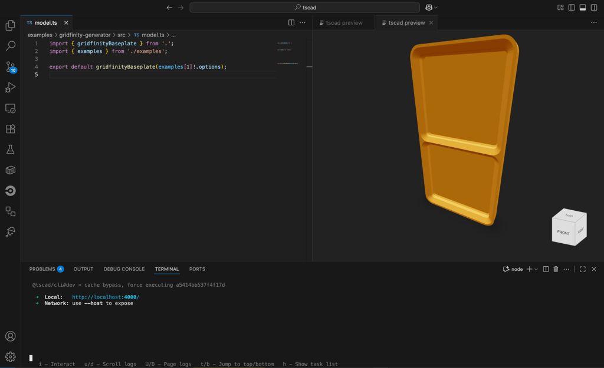

<!-- #region header -->
<!-- Generated by @toolsync/builtin/package-readme. Do not edit manually, instead run `toolsync prepare`. -->

# tscad-vscode

 

The official tscad VSCode extension

<!-- #endregion header -->

## Installation

Install the extension from [Visual Studio Marketplace](https://marketplace.visualstudio.com/items?itemName=tscad.tscad-vscode).

## Features

Provides an in-editor preview for your tscad models.

## Usage

Run `tscad dev` to start the development server. It should automatically open the preview. Otherwise type `v+enter` in the dev command's terminal.

<!-- ## Requirements -->

## Extension Settings

The extension currently does not add any VS Code settings.

## Known Issues

This extension (and the entire tscad ecosystem) is in active development and may have bugs or limitations. Please report any issues you encounter.

<!-- ## Release Notes -->

<!-- #region footer -->
<!-- Generated by @repo/toolsync-plugin. Do not edit manually, instead run `toolsync prepare`. -->

---

Developed as part of the [tscad](https://tscad.vercel.app) project.

<!-- #endregion footer -->
